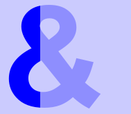

# Discrete-Icon-Gradient
A LESS mixin collection that allows you to show a partially-filled texticon.

Perfect for when you have an icon of signal-bars or such and want to fill some but not all of them. Allows for partially-transparent 'missing' bars, your own fallbacks, etc. Should be pretty cross-compatible, but no promises.


##Usage
Let's say we want to modify this glyphicon to be more colorful:


Simply give it the LESS rule, 
```
    .discrete-gradient(red, blue, 30%);
```
which translates to:
```
    background: linear-gradient(to right, red 0%,red 29%,blue 30%,blue 100%);
    -webkit-background-clip: text;
    -webkit-text-fill-color: transparent;
```
and results in:


## Another Example
```
<i class="example0">&amp;</i>
```

```
.example0 {
    .discrete-gradient(blue, fade(blue, 50%), 50%);
}
```

Which results in: 


